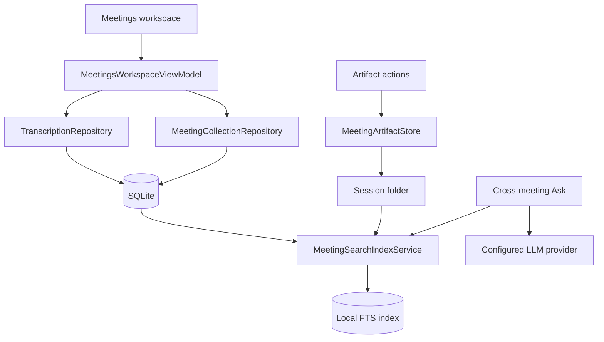

# Plan: Productize Meetings Workspace

> **Executor instructions**: Treat this as staged productization of
> MacParakeet's existing meeting system. The first safe slices are Meetings
> workspace legibility, artifact-folder actions, and app-smoke scaffolding.
> Cross-meeting Ask is
> blocked on a local index and should not be implemented by scanning the whole
> database or by sending full meeting histories to an LLM provider.
>
> **Drift check (run first)**:
> `git diff --stat 225c61dfc..HEAD -- Sources/MacParakeet/Views/Meetings Sources/MacParakeet/Views/Transcription Sources/MacParakeetViewModels/MeetingsWorkspaceViewModel.swift Sources/MacParakeetCore/Database Sources/MacParakeetCore/Services/MeetingRecording Tests/MacParakeetTests/ViewModels/MeetingsWorkspaceViewModelTests.swift spec/09-testing.md docs/human-qa-guide.md plans/completed/2026-06-19-boundary-contracts.md`
> If any of those paths changed since this plan was written, compare the
> current-state notes below against the live files before editing.

## Status

- **Priority**: P2
- **Effort**: L
- **Risk**: MED
- **Depends on**: soft dependency on
  `plans/completed/2026-06-19-boundary-contracts.md` for artifact-contract
  language and smoke-test expectations
- **Category**: meetings / product / qa
- **Planned at**: commit `225c61dfc`, 2026-06-19

## Why this matters

The product review surfaced ideas worth adapting to MacParakeet's meeting
workflow: make meetings easier to scan, make notes and artifacts more visible,
and prove the whole app workflow with smoke coverage. MacParakeet already has a
solid local-first meeting stack, durable local artifacts, native capture, and no
account system; this plan builds on those strengths.

MacParakeet already has most of the hard substrate: live recording state,
calendar preview, recovery attention, recent meetings, per-transcript chat,
notes, prompt results, automation hooks, and materialized meeting folders.
This plan makes those capabilities more legible and testable, then stages the
larger workflow additions: DB-backed folders/projects, local cross-meeting
indexing, and cross-meeting Ask.

## Product ideas reviewed

| Idea | Verdict | MacParakeet-shaped interpretation |
|------------|---------|-----------------------------------|
| Turn Meetings into the daily workspace | Valid and near-term | Keep the existing native `MeetingsView`, but make it more compact and scannable: live status, next meetings, needs attention, previous meetings, All Notes entry point, search, and quick start in one workspace. |
| Add folders/tags/projects for meeting notes | Valid, but staged | Store organization in SQLite, not filesystem folders. Start with folders/projects as user-visible collections; add tags once the collection model is proven. Enforce exclusive folder/project assignment in the persistence layer, not only in UI state. Mirror metadata into artifacts as a refreshable snapshot, not the source of truth. |
| Add cross-meeting Ask after local indexing | Valid later | Current Ask is per transcript. Build a local FTS/index layer over transcripts, notes, summaries, and prompt results first; then add Ask with bounded citations and explicit privacy behavior. |
| Make artifacts more visible | Valid and small | The artifact store already writes `manifest.json`, `transcript.json`, `notes.md`, and prompt-result files. The UI should expose "Open Meeting Folder" and "Copy Artifact Path" independently from audio-file availability. |
| Add full-app meeting smoke tests | Valid, with harness work | Existing coverage is strong at unit/integration level, but there is no UI-test target. Add a DEBUG/test launch seam and smoke harness before relying on end-to-end app workflow proof. |

## Current state

- `Sources/MacParakeet/Views/Meetings/MeetingsView.swift:104-139` has a
  Meetings header, live status chip, and recording tile. `:151-166` lays out
  Upcoming plus Recent Meetings on the left and Attention, Intelligence, Auto
  Notes, and Meeting Prompts on the right.
- `Sources/MacParakeet/Views/Meetings/MeetingsView.swift:406-520` already
  includes Recent Meetings search and grouped rows. The row menu at `:470-502`
  is audio-centric: Open, Show in Finder, Save Audio As, Delete Audio.
- `Sources/MacParakeetViewModels/MeetingsWorkspaceViewModel.swift:69-80`
  owns the recent-meetings VM, meeting pill VM, settings, LLM settings, quick
  prompts, and prompt library. `:123-139` refreshes recent meetings, upcoming
  events, quick prompts, and auto-notes. `:297-335` produces attention items
  for recovery, recording errors, and AI unavailability.
- `Sources/MacParakeet/Views/Transcription/TranscriptResultView.swift:460-489`
  has an Audio menu for meeting details. It is disabled when the mixed audio
  file is missing, so it cannot expose artifacts that still exist after audio
  retention or user deletion.
- `Sources/MacParakeet/Views/Transcription/TranscriptResultView.swift:1895-1910`
  has per-transcript chat with the prompt "Ask about this transcript...".
  There is no cross-meeting Ask surface.
- `Sources/MacParakeetCore/Services/MeetingRecording/MeetingArtifactStore.swift:25-37`
  defines `MeetingArtifactSnapshot`; `:68-74` defines artifact schema and
  stable filenames; `:82-146` materializes the folder, manifest, transcript,
  notes, and prompt-result files.
- `Sources/MacParakeetCore/Services/MeetingRecording/MeetingAutomationHookRunner.swift`
  already consumes `MeetingArtifactSnapshot` and passes artifact directory and
  manifest paths to hooks. The app UI does not make those same artifact
  affordances first-class.
- `Sources/MacParakeetCore/Database/DatabaseManager.swift:60-87` originally
  created an FTS5 table for dictations; `:311-319` later dropped it because
  search used LIKE and the FTS table was unused. `:535-545` added
  `transcriptions.userNotes` for live meeting notes.
- `Sources/MacParakeetCore/Database/TranscriptionRepository.swift:125-214`
  handles library search by fetching candidate rows and applying Unicode
  matching in Swift. `:315-335` does the same for repository search. That is
  acceptable for library filtering but not a foundation for cross-meeting Ask.
- `Sources/MacParakeetCore/Database/README.md:50-54` requires one repository
  per table and cross-table joins at the service layer. New organization and
  index work should follow that split.
- `Tests/MacParakeetTests/ViewModels/MeetingsWorkspaceViewModelTests.swift`
  covers calendar filtering, recurring collapse, recording status, attention
  items, and prompt preview behavior. It does not prove the full app workflow.
- `spec/09-testing.md:86-122` documents broad meeting recording and scheduler
  coverage. `:153-160` explicitly skips SwiftUI view tests, audio capture
  tests, and visual snapshots in favor of ViewModel/state tests and manual QA.
- `docs/human-qa-guide.md:35-61` documents the dev-app manual QA path and the
  separate dev bundle ID, but there is no reusable meeting workflow smoke
  harness today.

## Scope

### In scope

- Reframe the Meetings screen as a compact daily workspace for meeting users.
- Add a lightweight All Notes entry point for notes-bearing meetings without
  creating a separate notebook model in the first slice.
- Add direct artifact actions to meeting list rows and meeting detail.
- Add a full-app smoke foundation for meeting workflows using throwaway app
  state, debug launch seams, or an equivalent safe harness.
- Add DB-backed organization for meeting notes and recordings, with artifacts
  mirroring organization metadata as a refreshable snapshot.
- Add a local meeting index over transcript, notes, summaries, and prompt
  results before cross-meeting Ask.
- Add cross-meeting Ask only after the local index exists and privacy behavior
  is explicit in the UI and tests.
- Update specs, testing docs, and active-plan status as slices land.

### Out of scope

- Replacing MacParakeet's existing meeting recording pipeline, recovery model,
  or local artifact folder contract.
- Changing MacParakeet's local-first architecture, account-free product model,
  or on-device meeting artifact contract.
- Building semantic/vector search in the first slice. Start with SQLite FTS or
  an equivalent local text index that fits the current GRDB stack.
- Sending full meeting history to an LLM provider for cross-meeting Ask.
- Making filesystem folders canonical for user organization.
- Adding brittle visual snapshot tests as the main quality gate.

### Invariants

- The `transcriptions` row remains the canonical meeting record. Artifact files
  are durable local outputs and automation inputs, not the primary database.
- Meeting artifacts remain local-first. No audio, transcript, notes, prompt
  result, or index content enters telemetry.
- Cross-meeting Ask is user-triggered. If the configured LLM provider is remote,
  only bounded, cited snippets selected from the local index may be sent.
- Meeting organization is DB-backed and survives artifact folder moves or
  retention actions.
- Audio retention and user audio deletion must not remove transcript, notes,
  organization, prompt results, or artifact-folder discoverability.
- Full-app smoke must use throwaway app support and database state. It must not
  touch the user's production app database.

## Requirements

### Meetings workspace

- R1. Meetings opens to a scannable workspace with live/paused/transcribing
  status, quick start, next meetings, needs attention, recent meetings, and
  search visible without forcing users through the general Library.
- R2. The workspace copy and section names are immediately legible to meeting
  users. Prefer plain labels such as Upcoming, Previous, Needs Attention, and
  Search over implementation-centric labels.
- R3. Existing calendar settings, auto-notes setup, quick prompts, recovery
  actions, and recent-meeting loading behavior remain available.
- R4. All Notes is a meeting filter or entry point over notes-bearing saved
  meetings in the first slice, not a separate canonical notes database.
- R5. The workspace stays compact on desktop and single-column on narrower
  windows without hiding recovery or live-recording state.

### Organization

- R6. Users can organize meeting notes/recordings with DB-backed folders or
  projects. Tags can share the same durable model or follow after folders and
  projects prove the interaction.
- R7. Organization applies to meeting records, not files. Moving a meeting
  between folders/projects must not move the artifact folder by default.
- R8. Library, Meetings, and meeting detail filters agree on collection
  membership and cannot show conflicting organization state.
- R9. Artifact manifests may include organization metadata as a snapshot, but
  the DB remains canonical.
- R9a. If folders/projects are exclusive, exclusivity is enforced by the
  repository and, where the chosen schema permits it, by SQLite constraints.
  Tags may remain many-to-many, but folder/project assignment cannot rely only
  on SwiftUI selection state.
- R9b. Collection rename, delete, reorder, and membership changes define a
  manifest refresh strategy. UI reads current organization from SQLite; artifact
  manifests are last-materialized snapshots refreshed during materialization,
  export/open-folder actions, or an explicit best-effort batch refresh.

### Local index and cross-meeting Ask

- R10. Cross-meeting search and Ask use a local index over stored meeting
  transcript text, user notes, auto-generated summaries, and prompt results.
- R11. Index updates are triggered by the same writes that change canonical
  data: meeting finalization, note writes, prompt-result writes, title edits,
  meeting deletion, and organization updates when organization becomes
  searchable.
- R12. The search index has a rebuild path so migrations or corruption do not
  strand meetings outside Ask/search.
- R13. Cross-meeting Ask responses cite source meetings and let users open the
  source meeting detail.
- R13a. Citations use stable meeting IDs and a typed local route, not
  title-only text or filesystem paths. A renderer may expose that route as a
  Markdown link such as `macparakeet://meetings/<uuid>?snippet=<snippet-id>`
  after URL handling exists, but the model contract is the typed route.
- R14. Cross-meeting Ask assembles a bounded context from local search results,
  never all meeting history.
- R15. Privacy behavior is explicit: local indexing is always on-device; remote
  LLM providers receive only the snippets needed for the user's question.

### Artifact visibility

- R16. Meeting list rows and meeting detail expose "Open Meeting Folder" when a
  session folder exists, even when the mixed audio file has been deleted or
  retained out.
- R17. Users can copy artifact paths for automation or support without opening
  Finder.
- R18. Existing audio actions remain audio-specific and disabled by audio
  availability. Artifact actions use folder/manifest availability instead.

### Full-app smoke

- R19. A meeting workflow smoke harness can launch the app with throwaway app
  support, database, settings, and artifact directories.
- R20. The smoke covers start, pause, resume, stop/finalize, recovery discovery,
  notes persistence, calendar settings visibility, artifact-folder visibility,
  and saved meeting detail.
- R21. The smoke avoids hardware and model dependence for its default path by
  using DEBUG-only dependency seams or deterministic fixture injection.
- R22. Manual QA remains available for real microphone/system-audio permission
  checks. The smoke harness covers app workflow regressions, not macOS device
  behavior.

## Key technical decisions

- **Productize the native Meetings workspace.** MacParakeet already has native
  capture, recovery, notes, prompt results, and local artifacts. The plan adapts
  the strongest product ideas to that existing foundation.
- **Keep organization in SQLite.** Filesystem folders are output locations and
  automation surfaces. Meeting organization needs queryability, deletion
  semantics, tests, and artifact snapshots, so it belongs in the DB.
- **Build folders/projects before full tags if needed.** A unified collection
  model can support folder/project/tag kinds, but the first UI should stay
  simple. If the implementation proves a unified model adds risk, ship folders
  first and add tags later without blocking the workspace improvements.
- **Make organization constraints explicit.** If the product rule is "one
  folder" or "one project" per meeting, that rule belongs in persistence and
  repository tests. For a unified collection model, prefer membership rows that
  carry `collectionKind`, a composite foreign key to the collection identity,
  and a partial unique index for exclusive kinds; otherwise choose a narrower
  folder/project schema that encodes exclusivity directly.
- **Treat artifact organization as a snapshot.** Manifests can help automation
  and support, but they cannot be the source of current folder/project state.
  Collection writes should either refresh affected manifests best-effort or
  guarantee the next materialization/export/open-folder action refreshes them.
- **Index before Ask.** The current scan-based repository search is not the
  right foundation for cross-meeting Ask. Add a local FTS/index service first,
  then use it for retrieval, citations, and bounded prompt context.
- **Keep artifact actions independent from audio actions.** The current UI
  disables the whole Audio menu when the mixed audio file is gone. Artifact
  folders can still be useful after audio retention, so they need separate
  availability checks.
- **Use smoke seams, not visual snapshots.** The repo deliberately avoids
  SwiftUI snapshots. A meeting smoke harness should make app state injectable
  and observable, then drive the workflow at the app boundary.

## High-level design

The left side is near-term product polish: Meetings workspace and artifact
actions. The center adds DB-backed organization. The right side is deliberately
later: local index first, Ask UI second, with the LLM receiving bounded snippets
from local retrieval.

## Implementation units

### U1. Meetings workspace legibility

- **Goal:** Make Meetings feel like the home screen for meeting users without
  changing capture semantics.
- **Dependencies:** none
- **Files:**
  - `Sources/MacParakeet/Views/Meetings/MeetingsView.swift`
  - `Sources/MacParakeetViewModels/MeetingsWorkspaceViewModel.swift`
  - `Tests/MacParakeetTests/ViewModels/MeetingsWorkspaceViewModelTests.swift`
  - `spec/02-features.md`
  - `spec/04-ui-patterns.md`
- **Approach:**
  - Keep the existing `MeetingsView` and view model rather than adding a
    parallel workspace.
  - Rename or reorganize sections toward meeting-user language: Upcoming,
    Previous, All Notes, Needs Attention, Ask/Prompts, and Search.
  - Make All Notes a lightweight entry point over meetings with `userNotes` or
    notes-like prompt outputs. Do not introduce a second notes store in this
    slice.
  - Keep quick start and live status at the top; avoid a large hero or
    marketing-style shell.
  - Make search more persistent and useful in the Meetings context, while
    still delegating data loading to `TranscriptionLibraryViewModel` until the
    organization/index work lands.
  - Preserve the CPU guard around the live elapsed-time chip; do not move
    per-second state reads back into the full body.
- **Patterns to follow:**
  - `MeetingsLiveStatusChip` isolation in `MeetingsView`.
  - `MeetingsWorkspaceViewModel.attentionItems` for recovery/error/AI states.
  - Existing `parakeetAction` button styling.
- **Test scenarios:**
  - When recording state changes from idle to recording/paused/transcribing,
    the view model exposes the correct workspace status and active-recording
    flag.
  - When recovery count, recording error, and AI unavailable states coexist,
    attention items remain deduplicated and ordered by action urgency.
  - When calendar mode is off, Upcoming stays empty and does not fetch events.
  - When recent meetings are empty with and without a search query, the empty
    state points to the correct action and does not hide recovery attention.
- **Verification:** Focused ViewModel tests prove state behavior; manual/dev-app
  QA proves the workspace is compact and readable at narrow and wide widths.

### U2. Artifact visibility actions

> **Update (2026-06-21):** Effectively **shipped**. The durable artifact-folder
> locator (`transcriptions.meetingArtifactFolderPath`, preserved across "Delete
> Audio" and retention) plus the UI actions — `MeetingArtifactActions`
> (`openFolder` / `copyFolderPath`) with "Open Meeting Folder" / "Copy Artifact
> Path" wired into the Library, Transcript, and Meetings views — both landed
> (artifact persistence via #577; contract codified in
> [`spec/contracts/meeting-artifacts-v1.md`](../../spec/contracts/meeting-artifacts-v1.md)).
> Keep this unit only as a reference for residual polish; the core scope is done.

- **Goal:** Expose meeting folders and artifact paths directly from the UI.
- **Dependencies:** boundary-contract wording from
  `plans/completed/2026-06-19-boundary-contracts.md` is useful but not blocking.
- **Files:**
  - `Sources/MacParakeet/Views/Transcription/MeetingAudioActions.swift`
  - `Sources/MacParakeet/Views/Meetings/MeetingsView.swift`
  - `Sources/MacParakeet/Views/Transcription/TranscriptResultView.swift`
  - `Sources/MacParakeetCore/Services/MeetingRecording/MeetingArtifactStore.swift`
  - `Tests/MacParakeetTests/Services/MeetingRecording/MeetingArtifactStoreTests.swift`
  - `Tests/MacParakeetTests/Audio/MeetingAudioFileTests.swift`
- **Approach:**
  - Preserve a durable artifact folder locator on the meeting row. `filePath`
    remains the mixed-audio playback/export path and may be cleared by
    retention or "Delete Audio Only"; artifact actions use the folder locator.
  - Add a small UI-layer `MeetingArtifactActions` helper or extend the existing
    action helper without making artifact behavior depend on mixed-audio
    availability.
  - Add menu items for "Open Meeting Folder" and "Copy Artifact Path" on recent
    meeting rows and meeting detail.
  - Enable "Open Meeting Folder" when
    `MeetingArtifactStore.sessionFolderURL(for:)` resolves and the folder
    exists. Treat manifest existence as an optional stronger state for copying
    the manifest path.
  - Keep "Show Audio in Finder", "Save Audio As", and "Delete Audio" disabled
    based on `MeetingAudioFile.isAvailable`.
  - Consider "Copy Manifest Path" only if it does not clutter the first menu.
- **Patterns to follow:**
  - `MeetingAudioActions` as a UI wrapper around core file/path logic.
  - `MeetingAutomationHookRunner` environment values as proof that artifact
    folder and manifest paths are already automation surfaces.
- **Test scenarios:**
  - A meeting with existing folder but missing `meeting.m4a` exposes artifact
    availability and keeps audio actions unavailable.
  - A meeting without `filePath` but with a durable artifact folder exposes
    artifact actions and keeps audio actions unavailable.
  - A meeting without `filePath` and without a durable artifact folder exposes
    neither audio nor artifact actions.
  - Audio deletion and retention clear `filePath` but preserve the artifact
    folder locator; full meeting deletion removes the folder even after audio
    was already deleted.
  - Copy/open helpers resolve the session folder, not the mixed audio file.
  - Artifact materialization still writes stable snapshot paths after the new
    UI helper reads them.
- **Verification:** Focused helper tests cover path availability; dev-app QA
  verifies menu copy, disabled states, and Finder opening.

### U3. Full-app meeting smoke foundation

- **Goal:** Add a reusable app workflow proof path before expanding meeting UI
  and persistence scope further.
- **Dependencies:** none; should land before U4-U7 when practical.
- **Files:**
  - `Package.swift`
  - `Sources/MacParakeet/App/AppStartupBootstrapper.swift`
  - `Sources/MacParakeet/App/AppEnvironment.swift`
  - `Sources/MacParakeet/App/AppEnvironmentConfigurer.swift`
  - `Sources/MacParakeet/App/DebugMeetingWorkflowQA.swift`
  - `Tests/MacParakeetAppSmokeTests/`
  - `scripts/dev/meeting_workflow_smoke.sh`
  - `spec/09-testing.md`
  - `docs/human-qa-guide.md`
- **Approach:**
  - Add a DEBUG-only app support/database override or equivalent launch
    argument so a smoke run cannot touch production `macparakeet.db`.
  - Add deterministic meeting workflow injection for the default smoke path:
    fake calendar event, fake/fixture recording source, model-free
    finalization, and seeded settings.
  - Add accessibility identifiers only where needed to drive the smoke; avoid
    broad UI-test churn.
  - Use a separate smoke test target or script that builds and launches the dev
    app, drives the workflow, and inspects the throwaway DB/artifact folder.
  - Keep real microphone/system-audio permission checks in manual QA.
- **Patterns to follow:**
  - `scripts/dev/run_app.sh` for dev app signing/launch expectations.
  - `docs/human-qa-guide.md` for manual QA boundaries.
  - `DatabaseManager(path:)` and CLI `--database` tests for isolated DB state.
  - `DebugDictationPreviewQA` for debug-only app behavior.
- **Test scenarios:**
  - Smoke launch creates an isolated database under a throwaway root.
  - Start, pause, resume, stop, and finalize produce a saved meeting row and
    artifact folder in the throwaway root.
  - Notes typed or injected during the meeting persist to the DB and `notes.md`.
  - A seeded interrupted recording is discovered as recovery attention.
  - Calendar settings and saved meeting detail open without touching real
    settings or the production database.
- **Verification:** The smoke exits nonzero on missing DB rows, missing notes,
  missing artifacts, broken recovery attention, or inability to open saved
  meeting detail.

### U4. DB-backed meeting collections

- **Goal:** Add durable organization for meeting notes and recordings.
- **Dependencies:** U3 preferred before large persistence/UI changes.
- **Files:**
  - `Sources/MacParakeetCore/Database/DatabaseManager.swift`
  - `Sources/MacParakeetCore/Database/README.md`
  - `Sources/MacParakeetCore/Models/MeetingCollection.swift`
  - `Sources/MacParakeetCore/Models/MeetingCollectionMembership.swift`
  - `Sources/MacParakeetCore/Database/MeetingCollectionRepository.swift`
  - `Sources/MacParakeetCore/Services/MeetingRecording/MeetingArtifactStore.swift`
  - `Tests/MacParakeetTests/Database/MeetingCollectionRepositoryTests.swift`
  - `Tests/MacParakeetTests/Database/DatabaseManagerTests.swift`
  - `spec/01-data-model.md`
- **Approach:**
  - Add `meeting_collections` and `meeting_collection_memberships` or a
    narrower folder-first schema if implementation risk argues against a
    unified model.
  - If using a unified model, include a constrained `kind` such as `folder`,
    `project`, and `tag`, but expose only the kinds that have finished UX.
  - Encode exclusive folder/project semantics below the UI. For a unified
    schema, membership rows should include the collection kind, validate it
    against the collection via repository code and preferably a composite
    foreign key, and use a partial unique index so a meeting cannot have two
    active memberships for the same exclusive kind. If that is too much
    migration risk, use a narrower folder/project schema that makes one active
    assignment per kind structurally obvious.
  - Enforce source-type rules in repository/service code: only meeting
    transcriptions can be assigned.
  - Preserve deletion semantics with foreign keys or explicit cleanup when a
    meeting or collection is deleted.
  - Mirror collection names/IDs into `manifest.json` as a snapshot after
    materialization, but keep the DB canonical. Collection rename/delete/reorder
    and membership changes should trigger either best-effort rematerialization
    for affected existing artifact folders or a clearly documented lazy refresh
    on next materialize/export/open-folder action.
- **Patterns to follow:**
  - One repository per table from `Sources/MacParakeetCore/Database/README.md`.
  - GRDB `fetchOne(key:)` and Codable-aware predicates for UUID lookups.
  - Prompt and quick-prompt repositories for CRUD plus tests.
- **Test scenarios:**
  - Creating, renaming, archiving/deleting, and reordering collections persists
    across reopening a file-backed database.
  - Assigning a meeting to a second folder or project replaces the prior
    assignment or returns an explicit validation result, according to the
    chosen UX. Assigning tags remains many-to-many only if tags ship.
  - Repository tests prove folder/project exclusivity at the lowest layer that
    the chosen schema supports.
  - Assigning a non-meeting transcription fails or is ignored with an explicit
    result.
  - Deleting a meeting removes memberships without deleting the collection.
  - Materializing artifacts after collection changes writes a manifest snapshot
    without making the manifest canonical; rename/delete/membership changes are
    either rematerialized best-effort or refreshed by the next documented
    artifact action.
- **Verification:** In-memory and file-backed DB tests cover migration,
  repository behavior, and artifact snapshot updates.

### U5. Organization UI and filters

- **Goal:** Make folders/projects usable from Meetings, Library, and meeting
  detail without fragmenting the model.
- **Dependencies:** U4
- **Files:**
  - `Sources/MacParakeet/Views/Meetings/MeetingsView.swift`
  - `Sources/MacParakeet/Views/Transcription/TranscriptionLibraryView.swift`
  - `Sources/MacParakeet/Views/Transcription/TranscriptResultView.swift`
  - `Sources/MacParakeetViewModels/MeetingsWorkspaceViewModel.swift`
  - `Sources/MacParakeetViewModels/TranscriptionLibraryViewModel.swift`
  - `Tests/MacParakeetTests/ViewModels/MeetingsWorkspaceViewModelTests.swift`
  - `Tests/MacParakeetTests/ViewModels/TranscriptionLibraryViewModelTests.swift`
  - `spec/04-ui-patterns.md`
- **Approach:**
  - Add compact folder/project filters to Meetings without turning the page into
    a file manager.
  - Add assign/move controls from meeting row menus and meeting detail.
  - Make "All Meetings" and search remain obvious escape hatches.
  - Keep tags hidden or secondary until the interaction is proven.
  - Ensure list filtering composes with favorites, source type, pagination, and
    search.
- **Patterns to follow:**
  - `TranscriptionLibraryViewModel` pagination/search behavior.
  - Existing row menus in `MeetingsView` and `TranscriptionLibraryView`.
- **Test scenarios:**
  - Filtering by a collection shows only assigned meetings and preserves
    date-group ordering.
  - Moving a meeting between collections updates Meetings and Library filters
    consistently.
  - Search within a selected collection does not leak results from other
    collections.
  - Empty collection state offers a useful action without hiding global search.
- **Verification:** ViewModel tests prove filter composition; dev-app QA proves
  row-menu and detail assignment flows.

### U6. Local meeting search index

- **Goal:** Provide a scalable local retrieval layer for all-meeting search and
  future Ask.
- **Dependencies:** U3 preferred; U4 optional unless organization needs to be
  searchable in the first index slice.
- **Files:**
  - `Sources/MacParakeetCore/Database/DatabaseManager.swift`
  - `Sources/MacParakeetCore/Database/MeetingSearchIndexRepository.swift`
  - `Sources/MacParakeetCore/Services/MeetingSearchIndexService.swift`
  - `Sources/MacParakeetCore/Database/TranscriptionRepository.swift`
  - `Sources/MacParakeetCore/Database/PromptResultRepository.swift`
  - `Sources/MacParakeetCore/Services/TranscriptionService.swift`
  - `Tests/MacParakeetTests/Database/MeetingSearchIndexRepositoryTests.swift`
  - `Tests/MacParakeetTests/Services/MeetingSearchIndexServiceTests.swift`
  - `spec/01-data-model.md`
- **Approach:**
  - Add an FTS5-backed local index or equivalent GRDB-compatible structure that
    stores searchable documents by meeting ID and field type.
  - Index raw/clean transcript text, `userNotes`, prompt-result output, and
    summary-like prompt results. Include meeting titles for retrieval and
    display.
  - Add an idempotent rebuild path that clears/recreates the index from the
    canonical DB rows.
  - Update the index when finalization, notes, prompt results, title edits, and
    deletion occur.
  - Keep telemetry and LLM run metadata free of indexed content.
- **Patterns to follow:**
  - Earlier FTS migration history in `DatabaseManager`.
  - `UnicodeSearch` behavior for user-facing search expectations.
  - `LLMRunRepository` privacy rule: metadata only, no prompt/output content.
- **Test scenarios:**
  - Indexing a meeting makes transcript, notes, and prompt-result terms
    searchable with meeting IDs and field labels.
  - Updating notes or prompt results replaces stale indexed content.
  - Deleting a meeting removes all indexed documents for that meeting.
  - Rebuild from canonical rows restores results after the index is empty.
  - Search handles diacritics/case well enough to preserve current Unicode
    search expectations or documents any intentional difference.
- **Verification:** Database/service tests prove update and rebuild semantics;
  performance smoke uses seeded multi-meeting data to catch obvious full-scan
  regressions.

### U7. Cross-meeting Ask

- **Goal:** Let users ask questions across meetings with cited, bounded local
  retrieval.
- **Dependencies:** U6
- **Files:**
  - `Sources/MacParakeet/Views/Meetings/MeetingsView.swift`
  - `Sources/MacParakeet/Views/Meetings/CrossMeetingAskView.swift`
  - `Sources/MacParakeetViewModels/CrossMeetingAskViewModel.swift`
  - `Sources/MacParakeetCore/Services/MeetingSearchIndexService.swift`
  - `Sources/MacParakeetCore/Services/LLM/LLMService.swift`
  - `Sources/MacParakeetCore/Database/ChatConversationRepository.swift`
  - `Tests/MacParakeetTests/ViewModels/CrossMeetingAskViewModelTests.swift`
  - `Tests/MacParakeetTests/Services/LLM/LLMServiceTests.swift`
  - `spec/11-llm-integration.md`
- **Approach:**
  - Add an Ask surface in Meetings after the index can return cited snippets.
  - Retrieve top matching snippets locally, group by meeting, and assemble a
    bounded prompt context with meeting title/date/source anchors.
  - Show citations in the answer so users can open source meetings. The
    citation model should carry meeting UUID, optional snippet ID/range, display
    title, and date. Rendering may use a local URL like
    `macparakeet://meetings/<uuid>?snippet=<snippet-id>`, but routing tests
    should target the typed route so the app is not coupled to Markdown text.
  - Reuse provider setup status from existing LLM settings. If no provider is
    configured, show setup state rather than pretending local index alone can
    answer.
  - Make remote-provider behavior explicit near first use: snippets from
    selected meetings are sent to the configured provider.
- **Patterns to follow:**
  - Per-transcript chat UI and `TranscriptChatViewModel` behavior.
  - LLM service prompt construction tests with `userNotes`.
  - Existing local/remote provider setup states in `MeetingsWorkspaceViewModel`.
- **Test scenarios:**
  - Given indexed meetings with overlapping terms, Ask selects bounded snippets
    and includes source titles/IDs in prompt context.
  - If the provider is unavailable, Ask shows setup/unavailable state and does
    not run retrieval-to-provider.
  - If retrieval returns no snippets, Ask responds with a grounded empty state
    and does not send an empty all-history prompt.
  - Answer citations open the correct meeting detail.
  - Citation routing uses stable meeting IDs, rejects missing/deleted meetings
    gracefully, and never depends on a title string or artifact path.
  - Telemetry/LLM run metadata records provider/model/timing only and no
    transcript or notes content.
- **Verification:** ViewModel and service tests cover prompt assembly,
  provider gating, no-result behavior, and citation routing.

### U8. Documentation and rollout

- **Goal:** Keep specs, QA, and active plans aligned as the staged work lands.
- **Dependencies:** all shipped slices update their own docs; final cleanup
  depends on the implemented subset.
- **Files:**
  - `spec/01-data-model.md`
  - `spec/02-features.md`
  - `spec/04-ui-patterns.md`
  - `spec/09-testing.md`
  - `spec/11-llm-integration.md`
  - `docs/human-qa-guide.md`
  - `plans/README.md`
  - `plans/completed/2026-06-19-boundary-contracts.md`
- **Approach:**
  - Update data model docs when collection/index migrations land.
  - Update feature/UI docs when Meetings workspace and artifact actions land.
  - Update testing docs when the smoke harness exists, distinguishing it from
    manual hardware/permission QA.
  - Cross-link boundary contracts once `spec/contracts/` exists.
  - Mark this plan partial or archive only after the status board reflects the
    actual shipped subset.
- **Test scenarios:** Documentation-only changes need link/path checks and
  status-board consistency, not behavioral tests.
- **Verification:** Specs mention the new durable data surfaces; the status
  board accurately distinguishes shipped, partial, and deferred slices.

## Acceptance examples

- AE1. A meeting-heavy user opens Meetings and can see whether MacParakeet is
  recording, what meeting is next, whether anything needs attention, and the
  latest saved meetings without switching to Library.
- AE2. A user whose meeting audio was deleted by retention can still open the
  meeting folder and copy the artifact path from the saved meeting detail.
- AE3. A user can put a meeting into a project/folder, filter Meetings to that
  project/folder, and still find the same meeting from global meeting search.
- AE4. A user asks "What did we decide about onboarding last week?" and the app
  searches local meeting transcript/notes/summary content, sends only bounded
  cited snippets to the configured LLM provider, and returns answer citations.
- AE5. A smoke run launches the app with throwaway state, creates or injects a
  meeting workflow, verifies notes/artifacts/recovery/saved detail, and exits
  without touching the production app database.

## Risks and mitigations

| Risk | Mitigation |
|------|------------|
| Meetings screen becomes busy | Keep the first UI slice compact. Prefer clearer labels and hierarchy over adding new panels. Test narrow and wide layouts. |
| Unified folder/project/tag schema overfits | Allow a folder-first implementation if a generic collection model adds migration or UI risk. Preserve future extensibility in naming and docs. |
| FTS index drifts from canonical DB rows | Make indexing idempotent, add write-path tests, and include a rebuild command/service path. |
| Cross-meeting Ask leaks too much content | Bound retrieval, cite snippets, avoid full-history prompts, and test that telemetry/LLM run metadata excludes content. |
| Smoke tests become flaky | Keep default smoke model-free and hardware-free. Leave real permissions and audio devices to manual QA. |
| Artifact actions confuse users when audio is gone | Separate labels: "Open Meeting Folder" for artifacts, "Show Audio in Finder" for mixed audio. Use distinct disabled states. |

## Verification plan

- Add or update focused tests for each shipped slice:
  - `MeetingsWorkspaceViewModelTests`
  - `MeetingArtifactStoreTests`
  - `MeetingAudioFileTests`
  - `MeetingCollectionRepositoryTests`
  - `TranscriptionLibraryViewModelTests`
  - `MeetingSearchIndexRepositoryTests`
  - `MeetingSearchIndexServiceTests`
  - `CrossMeetingAskViewModelTests`
  - `LLMServiceTests`
- Run the full deterministic suite before merge.
- Run the meeting workflow smoke once U3 exists and on any PR that changes
  meeting workspace navigation, artifact visibility, finalization, recovery, or
  saved meeting detail.
- Run manual dev-app QA for real microphone/system-audio permissions,
  calendar permission behavior, Finder opening, and provider-specific Ask
  behavior.

## Deferred follow-up work

- Semantic/vector retrieval over local embeddings if FTS proves insufficient.
- Multi-device sync, team workspaces, accounts, or cloud transcript storage.
- Rich "All notes" notebook editing beyond the existing per-meeting notes
  model.
- Bulk operations for folders/projects until single-meeting organization is
  stable.
- UI snapshot tests unless the repo's testing policy changes.
